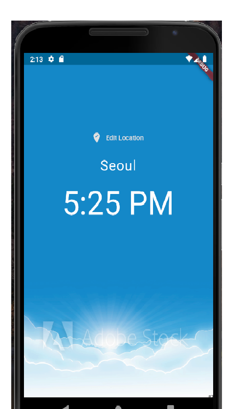
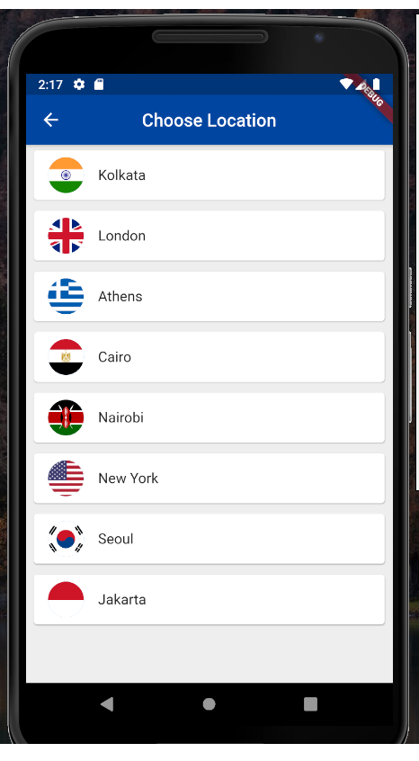

# A simple Flutter app that displays the time of various locations

# Technology used
  - Flutter
  - World time API (to get the time information for various cities)
  
# Features
  - Select your city
  - The time for that city is displayed
  - The background changes depending upon the time of the day

  
